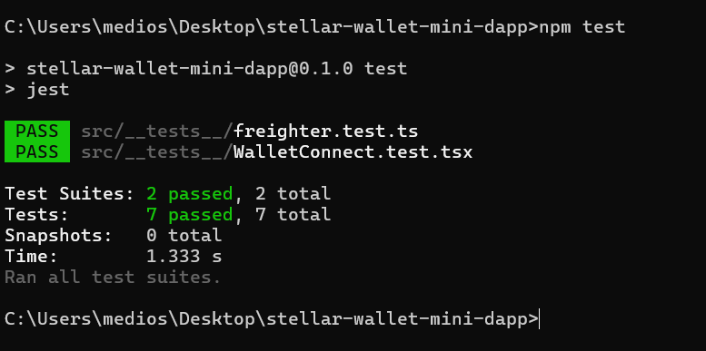

# Stellar Wallet Mini-dApp

A modern and user-friendly mini-dApp for managing Stellar network wallets. This application allows users to connect their **Stellar Freighter** wallets and view their **Testnet** XLM balances in real-time.

[](https://nextjs.org/)
[](https://stellar.org/)
[](https://www.typescriptlang.org/)
[](https://jestjs.io/)

---

## 🚀 Features

- **Freighter Wallet Integration**: Secure and fast wallet connection.
- **Live Balance Fetching**: View Testnet balances using the Stellar Horizon API.
- **Modular Architecture**: Separated `utils` and `components` for easy maintenance.
- **Dark Mode Support**: Modern design compatible with system preferences.
- **Unit Testing**: Suite built with Jest and React Testing Library.

## 🛠️ Technology Stack

- **Frontend**: [Next.js 15+](https://nextjs.org/) (App Router)
- **Language**: [TypeScript](https://www.typescriptlang.org/)
- **Blockchain SDK**: 
  - `@stellar/freighter-api` (Wallet interaction)
  - `stellar-sdk` (Horizon API communication)
- **Styling**: Vanilla CSS (Custom Properties)
- **Testing**: [Jest](https://jestjs.io/) & [React Testing Library](https://testing-library.com/docs/react-testing-library/intro/)

## 📋 Requirements

To use the application, you must have the **Stellar Freighter** browser extension installed.

- 🔗 [Download the Freighter Wallet extension here](https://www.freighter.app/)
- **Important**: Ensure your wallet is set to the **Testnet** network.

## ⚙️ Installation & Setup

### 1. Clone the Repository
```bash
git clone https://github.com/efekrbas/stellar-wallet-mini-dapp.git
cd stellar-wallet-mini-dapp
```

### 2. Install Dependencies
```bash
npm install
```

### 3. Run the Application
```bash
npm run dev
```
The application will run at `http://localhost:3000` by default.

## 🧪 Running Tests

To run the unit tests, use the following command:
```bash
npm test
```

### Test Results

*(A screenshot showing the successful test suite execution can be added here)*

<<<<<<< HEAD
 button.

=======
>>>>>>> beaf570 (refactor: fix lint errors, improve type safety, and add 100% test coverage for freighter utility)
## 🔗 Links

- **Live Demo**: [Embed your Vercel link here](https://stellar-wallet-mini-dapp-yourname.vercel.app)
- **Demo Video**: [Embed your Video link here](https://youtube.com/...)

## 🤝 Contributing

1. Fork the project.
2. Create your feature branch (`git checkout -b feature/AmazingFeature`).
3. Commit your changes (`git commit -m 'feat: add amazing feature'`).
4. Push to the branch (`git push origin feature/AmazingFeature`).
5. Open a Pull Request.

---
Built with ❤️ by [efekrbas](https://github.com/efekrbas)
